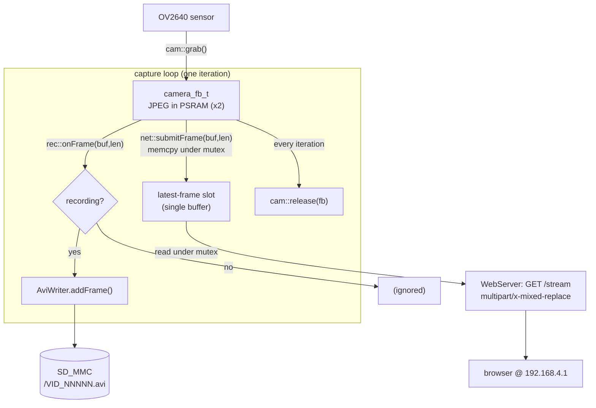

# XIAO ESP32-S3 Sense — WiFi MJPEG Stream + Button-Triggered SD Recording

**Date:** 2026-09-08
**Status:** Approved design, pre-implementation
**Target board:** Seeed Studio XIAO ESP32-S3 Sense (ESP32-S3, 8 MB PSRAM, OV2640 camera, microSD slot)

## 1. Goal

Firmware that, from a single camera pipeline, simultaneously:

1. Serves a live MJPEG video stream over WiFi with the device acting as its own
   access point (AP).
2. Records video to the microSD card as MJPEG-in-AVI files, started and stopped
   by the onboard button.
3. Accepts new firmware over WiFi (OTA) — no USB cable needed after the first
   flash.

Capture target: VGA (640x480), ~20 fps nominal (degrades gracefully under load).

## 2. Hardware / Platform Configuration

| Item | Value |
|---|---|
| PlatformIO board | `seeed_xiao_esp32s3` |
| Framework | arduino (espressif32 platform) |
| PSRAM | enabled (`-DBOARD_HAS_PSRAM`), required for frame buffers |
| Partition table | `min_spiffs.csv` — dual ~1.9 MB OTA app slots (OTA requires two slots) |
| Camera model | `CAMERA_MODEL_XIAO_ESP32S3` (pins from `esp32-camera` `camera_pins.h`) |
| SD interface | `SD_MMC` in 1-bit mode (CLK 7, CMD 9, D0 8) |
| Button | onboard BOOT button, GPIO0, active-low, `INPUT_PULLUP` |
| Indicator LED | onboard user LED, GPIO21, active-low |

Notes:
- Camera and SD_MMC 1-bit mode coexist on this board (documented Seeed pattern).
- 1-bit SDMMC sustained write is ~1–2 MB/s. A VGA JPEG frame is ~15–40 KB; at
  20 fps that is ~0.3–0.8 MB/s — within budget.

`platformio.ini` (final form):

```ini
[env:xiao]
platform = espressif32
board = seeed_xiao_esp32s3
framework = arduino
board_build.partitions = min_spiffs.csv
build_flags =
    -DBOARD_HAS_PSRAM
    -DCORE_DEBUG_LEVEL=3
lib_deps =
    espressif/esp32-camera
monitor_speed = 115200

; default = OTA upload over the device AP
upload_protocol = espota
upload_port = 192.168.4.1
upload_flags = --auth=${sysenv.OTA_PASSWORD}

[env:xiao-usb]
extends = env:xiao
upload_protocol = esptool
; upload_port auto-detected; use for the first flash
```

(If `esp32-camera` is already bundled with the arduino-esp32 core version in use,
the explicit `lib_deps` line is dropped — decided at implementation time.)

## 3. Module Breakdown

Each module is a `.h` / `.cpp` pair under `firmware/src/`. Interfaces are small
and free of cross-module globals; `main.cpp` owns wiring and the capture loop.

### 3.1 `camera` — camera lifecycle and frame access

```cpp
namespace cam {
  bool   begin();                 // init OV2640 at VGA; false on failure
  camera_fb_t* grab();            // get next frame buffer (blocks briefly); nullptr on error
  void   release(camera_fb_t* fb);// return buffer to the driver
  framesize_t frameSize();        // for callers that need dimensions
}
```

- `fb_count = 2`, `fb_location = CAMERA_FB_IN_PSRAM`, `pixel_format = PIXFORMAT_JPEG`,
  `jpeg_quality = 12` (tunable), `grab_mode = CAMERA_GRAB_LATEST`.
- No knowledge of WiFi, SD, or AVI. Pure capture.

### 3.2 `avi_writer` — MJPEG AVI container

```cpp
class AviWriter {
public:
  bool begin(fs::FS& fs, const char* path, uint16_t w, uint16_t h);
  bool addFrame(const uint8_t* buf, size_t len);   // appends one JPEG frame
  bool end(float measuredFps);                      // patches header, writes idx1
  size_t frameCount() const;
  uint32_t bytesWritten() const;
};
```

- On `begin`: write a fixed-layout RIFF/AVI header with placeholder sizes
  (`RIFF` size, `movi` size, `avih` total-frames, `strh` rate, `dwLength`,
  `MaxBytesPerSec`, `SuggestedBufferSize`). Store the file offsets that need
  patching.
- On `addFrame`: write a `00dc` chunk = 4-byte FOURCC + 4-byte little-endian
  length + payload + 1 pad byte if length is odd. Record `(offset, size)` for
  the index (kept in a growable in-RAM vector; ~8 bytes/frame — a 10-minute clip
  at 20 fps is ~12k entries ≈ 96 KB, acceptable in PSRAM, else spill to a temp
  file — implementation decides based on measured headroom).
- On `end`: append `idx1` (16 bytes/frame: FOURCC, flags=`AVIIF_KEYFRAME`,
  offset, size), then `seek` back and patch every stored offset. `measuredFps`
  (from `recorder`) sets `dwMicroSecPerFrame`, `dwRate`, `dwLength`.
- Depends only on an `fs::FS&` — unit-testable against `LittleFS` on host or any
  `FS` mock; no direct `SD_MMC` reference.

### 3.3 `recorder` — recording session management

```cpp
namespace rec {
  bool begin(fs::FS& fs);          // mount check, load/create counter
  bool isRecording();
  bool start();                    // opens next VID_NNNNN.avi; false if SD unavailable
  bool stop();                     // finalizes AVI, persists counter
  void onFrame(const uint8_t* buf, size_t len);  // no-op unless recording
  void tick();                     // periodic flush (~5 s), fps accounting
  const char* currentPath();
}
```

- File naming: `/VID_00001.avi`, zero-padded 5 digits. Next number stored in
  `/counter.txt` (plain integer text). Counter incremented and persisted on
  `start()` so a crash never reuses a number.
- fps measurement: `start()` records `t0` and frame counter; running average
  `frames / elapsed_seconds` is passed to `AviWriter::end`.
- Flush policy: `tick()` calls `file.flush()` every ~5 s → power loss loses at
  most ~5 s; the partial file has a valid header (placeholders) and is playable
  by tolerant players; `stop()` is what makes it fully correct.
- SD write failure inside `onFrame`: abort session (`AviWriter` discarded, file
  closed), set an error flag readable by `main` for LED feedback.

### 3.4 `streamer` — AP + HTTP MJPEG server

```cpp
namespace net {
  void begin(const char* ssid, const char* password);  // starts SoftAP + WebServer
  void handle();                                        // pump server, call each loop
  void submitFrame(const uint8_t* buf, size_t len);     // copy into shared latest slot
  uint8_t clientCount();
}
```

- SoftAP: SSID `XIAO-CAM-<last2bytes-of-MAC>`, password from a config constant
  (default provided, documented as changeable). Fixed IP `192.168.4.1`.
- `WebServer` on port 80:
  - `GET /` → minimal HTML page: `` plus a line of status text.
  - `GET /stream` → `multipart/x-mixed-replace; boundary=frame`; loop writes the
    latest frame as `--frame\r\nContent-Type: image/jpeg\r\nContent-Length: N\r\n\r\n`
    + bytes, throttled to the available frame rate.
  - `GET /status` → JSON `{recording, file, frames, fps, clients, sdFreeMB}`.
- `submitFrame` copies bytes into a single mutex-protected buffer (the "latest
  frame slot"), sized to a max expected JPEG (e.g. 64 KB, realloc if exceeded).
  The stream handler reads from this slot — it never touches `camera_fb_t`
  directly, so a slow client cannot stall the capture loop.

### 3.5 `button` — debounced input + LED output

```cpp
namespace btn {
  void begin();
  bool consumeShortPress();   // true once per completed short press
  void setLed(bool on);
  void blink(uint8_t pattern);// FAST_ERROR, DOUBLE, etc. (non-blocking)
}
```

- 25 ms debounce, press classified on release; only short press used for v1
  (long-press reserved).
- LED patterns driven from `main` state, updated non-blocking in `blink`/`setLed`
  via millis timing.

### 3.6 `ota` — over-the-air firmware update

```cpp
namespace ota {
  void begin(const char* hostname, const char* password);
  void handle();          // pump each loop
  bool inProgress();      // true while an update is being received
}
```

- Built on `ArduinoOTA` (espota protocol), which integrates directly with the
  PlatformIO upload flow — no extra client tooling:

  ```ini
  upload_protocol = espota
  upload_port = 192.168.4.1
  upload_flags = --auth=<ota_password>
  ```

  (USB upload still available by overriding `upload_port`, or via a second
  `[env:...usb]` that omits these lines.)
- Also registers a browser fallback on the existing `WebServer`: `GET /update`
  serves a file-upload form, `POST /update` streams the `.bin` through the
  `Update` library. Same firmware image works for both paths.
- `begin` uses hostname `xiao-cam` and a password from `config.h`
  (`OTA_PASSWORD`, default documented as changeable). mDNS advertises
  `xiao-cam.local` when the client supports it.
- On update start: `ota` calls back into `main` to **stop any active recording**
  (finalize the AVI), pause the capture loop, and show a distinct LED pattern
  (`OTA` = slow steady blink). Streaming clients are dropped. Device reboots on
  success; on failure it resumes normal operation.
- Partition note: `huge_app.csv` is single-app and does **not** support OTA. The
  partition table becomes `min_spiffs.csv` (two ~1.9 MB OTA app slots + small FS)
  or a custom `partitions_ota.csv` sized for the build. Firmware size is
  monitored against the ~1.9 MB slot at build time.

### 3.7 `main.cpp` — wiring + capture loop

```
setup():
  Serial.begin
  btn::begin();  btn::blink(BOOT)
  if (!cam::begin())            -> btn::blink(FAST_ERROR); halt
  bool sdOk = rec::begin(SD_MMC) after SD_MMC.begin("/sdcard", true /*1-bit*/)
  net::begin(SSID, PASS)
  ota::begin("xiao-cam", OTA_PASSWORD)   // registers /update on net's WebServer too
  LED off

loop():
  ota::handle();
  if (ota::inProgress()) { if (rec::isRecording()) rec::stop(); btn::blink(OTA); return; }
  camera_fb_t* fb = cam::grab();
  if (fb) {
    rec::onFrame(fb->buf, fb->len);     // writes to AVI if recording
    net::submitFrame(fb->buf, fb->len); // copies to stream slot
    cam::release(fb);
  }
  net::handle();
  rec::tick();
  if (btn::consumeShortPress()) {
    if (!sdOk)            btn::blink(DOUBLE);        // no card
    else if (rec::isRecording()) { rec::stop();  btn::setLed(false); }
    else if (rec::start())         btn::setLed(true);
    else                          btn::blink(DOUBLE); // start failed
  }
  if (rec::hadError()) { btn::blink(FAST_ERROR briefly); sdOk = false; }
```

Single-core loop for v1 (simplest correct version). If measured fps with a
client connected is unacceptable, a follow-up moves `net::handle` + the stream
writer onto core 0 as a task — the `submitFrame` mutex boundary already makes
that safe. Documented as a known optional optimization, not v1 scope.

## 4. Data Flow Summary



Same JPEG bytes feed both sinks; neither sink owns the buffer; `cam::release`
happens every iteration regardless of sink success.

Same JPEG bytes feed both sinks; neither sink owns the buffer; `cam::release`
happens every iteration regardless of sink success.

## 5. Error Handling

| Condition | Behavior |
|---|---|
| Camera init fails | Fast LED blink, halt in `setup` (nothing works without it) |
| SD not present / mount fails | Streaming runs normally; `rec::start` returns false; press → DOUBLE blink |
| SD write error during recording | Session aborted, file closed as-is, `hadError()` set, recording disabled until reboot |
| Counter file missing/corrupt | Treated as 0; next file is `VID_00001.avi` |
| Stream client disconnects mid-frame | `WebServer` write fails silently; handler returns; capture loop unaffected |
| PSRAM alloc for index too large | Spill index entries to `/idx.tmp`, merge on `end()` |
| Power loss while recording | Last ≤5 s lost; file has valid placeholder header, playable; no FS corruption beyond that file |
| OTA update starts | Active recording finalized, capture paused, stream clients dropped, OTA LED pattern; reboot on success |
| OTA update fails (bad image / interrupted) | `Update` rolls back, no partition switch, device resumes normal operation |
| Firmware exceeds OTA slot size | Caught at build time (linker/size check in CI); not a runtime condition |

## 6. Testing Strategy

### Host unit tests (PlatformIO `native` env, `test/`)

- **`test_avi_writer`**: feed a sequence of small valid JPEG blobs to `AviWriter`
  backed by a host filesystem `FS` shim (or a thin in-memory `FS`). Assert:
  - RIFF/AVI magic and structure offsets are byte-exact against a golden header.
  - Each `00dc` chunk has correct FOURCC, little-endian length, odd-length padding.
  - `idx1` entry count == frame count; each entry's offset points at a `00dc`
    FOURCC; sizes match.
  - After `end(20.0f)`: patched `dwMicroSecPerFrame` == 50000, `dwLength` == frames.
  - Output file passes `ffprobe` in a CI shell step (frame count, ~duration).
- **`test_recorder_naming`**: counter load/increment/persist; zero-padding;
  corrupt/missing counter file handled; number never reused across simulated
  restarts.

### Hardware verification (manual checklist, documented in `docs/`)

1. Power on → `XIAO-CAM-xxxx` AP appears; connect; `http://192.168.4.1` shows
   live video; `/status` JSON updates.
2. Press button → LED on; wait 30 s; press → LED off. Pull card, open
   `VID_00001.avi` in VLC: plays, ~30 s, correct orientation. `ffprobe` reports
   plausible fps/frame count.
3. Record while a browser stream is open → both work; note the fps in `/status`.
4. Remove card, press button → DOUBLE blink, stream still fine.
5. Yank power mid-recording → next boot, previous file still opens in VLC.
6. Connected to the AP, run `pio run -e xiao -t upload` (or open `/update` and
   upload `firmware.bin`) → device flashes, reboots, comes back on the new build;
   a recording in progress was finalized cleanly first.

## 7. Out of Scope (v1)

- STA mode / joining an existing router
- Signed / encrypted OTA images (plain `ArduinoOTA` password auth only)
- Automatic rollback verification beyond what `Update` provides
- RTSP
- Audio (the XIAO Sense PDM mic)
- Authentication on the web server
- Automatic card-full rotation / oldest-file deletion
- Long-press actions
- OTA updates
- Timestamp overlay on frames

## 8. File Layout

```
firmware/
  platformio.ini            (rewritten: seeed_xiao_esp32s3, min_spiffs, espota)
  src/
    main.cpp
    config.h                (WiFi SSID/pass, OTA_PASSWORD, jpeg quality, flush interval, pins)
    camera.h  camera.cpp
    avi_writer.h  avi_writer.cpp
    recorder.h  recorder.cpp
    streamer.h  streamer.cpp
    button.h  button.cpp
    ota.h  ota.cpp
  test/
    test_avi_writer/
    test_recorder_naming/
  docs/
    hardware-verification.md
```
